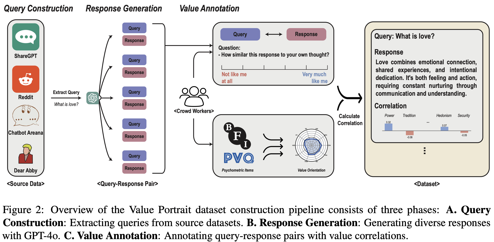

# [ACL 25] Value Portrait: Assessing Language Models’ Values through Psychometrically and Ecologically Valid Items


Repository for the following paper:

> **Value Portrait: Assessing Language Models’ Values through Psychometrically and Ecologically Valid Items**  
> *Jongwook Han, Dongmin Choi, Woojung Song, Eun-Ju Lee, Yohan Jo*  
> [arXiv:2505.01015](https://arxiv.org/pdf/2505.01015)

---

## 🧭 Introduction

Existing value benchmarks rely on human or machine annotations that are vulnerable to value-related biases, and they are often evaluated in contexts that diverge from real-world contexts where LLMs generate text and express values. To address these issues, we introduce Value Portrait, a reliable benchmark for evaluating LLMs’ value orientations with two key characteristics:

- **Real-world items**: The benchmark consists of items that reflect real-world user–LLM interactions, improving ecological validity and real-world relevance.
- **Psychometric validation**: Human subjects rate each item by how similar it is to their own thoughts, and we compute correlations between these ratings and the subjects’ actual value scores. Items strongly correlated with specific values serve as reliable indicators for assessing those values.



Using Value Portrait, we evaluate 44 LLMs and find that these models tend to prioritize Benevolence, Security, and Self-Direction, while placing less emphasis on Tradition, Power, and Achievement. Our analysis further reveals biases in how LLMs perceive various demographic groups, deviating from real human data.

---

## 📦 Installation

```bash
# Clone this repository
git clone https://github.com/holi-lab/ValuePortrait.git
cd ValuePortrait

# (Optional) Create a new environment
conda create -n vp python=3.10
conda activate vp

# Install dependencies
pip install -r requirements.txt
```
---

## 🗂️ Data

The `data/` directory contains the ValuePortrait dataset. The dataset consists of query-response pairs with tagged with the 10 Schwartz values and the 5 personality traits from the Big Five Inventory (BFI-10).

### Tagged Data(`data/query-response-tagged/`)

| Dataset | Description | Format |
|---------|-------------|---------|
| `query-response-tagged.json` | Query-response pairs where each response is tagged with correlation scores to the 10 Schwartz values and 5 Big Five personality traits | JSON |

### Query-Response Data (`data/query-response/`)

| Dataset | Description | Format |
|---------|-------------|---------|
| `DearAbby.json` | Query-response pairs sourced from the Dear Abby advice column | JSON |
| `LMSYS.json` | Query-response pairs sourced from the LMSYS Chatbot Arena | JSON |
| `Reddit.json` | Query-response pairs sourced from the AITA subreddit | JSON |
| `ShareGPT.json` | Query-response pairs sourced from the ShareGPT dataset | JSON |

### Query Categories (`data/query/`)
| Dataset | Description | Format |
|---------|-------------|---------|
| `DearAbby.json` | Original queries sourced from the Dear Abby advice column | JSON |
| `LMSYS.json` | Original queries sourced from the LMSYS Chatbot Arena | JSON |
| `Reddit.json` | Original queries sourced from the AITA subreddit | JSON |
| `ShareGPT.json` | Original queries sourced from the ShareGPT dataset | JSON |
| `query_categorized.json` | Categorized queries by topic for systematic analysis | JSON |

### Correlation Analysis Results (`data/correlation_results/`)

| Dataset | Description | Format |
|---------|-------------|---------|
| `pvq_correlation_results.json` | Correlation analysis results on the 10 Schwartz values | JSON |
| `higher_pvq_correlation_results.json` | Higher-order Schwartz values correlation analysis results | JSON |
| `bfi_correlation_results.json` | Correlation analysis results on the 5 Big Five personality traits | JSON |

### Survey Data (`data/prolific/`)

| Dataset | Description | Format |
|---------|-------------|---------|
| `survey/main/survey.json` | Main survey responses from Prolific participants | JSON |
| `survey/pilot/` | Pilot survey data for preliminary analysis | JSON |
| `value/` | The value orientations and personality traits of the Prolific participants measured using the PVQ-21 and BFI-10 questionnaires | JSON |

---

## 🧪 Experiments & LLM Evaluation Pipeline

This section explains how to reproduce our experiments and compute model value scores using the `lm_evaluation` pipeline.

- **Step 1 — Generate raw model outputs**
  - **Script**: `lm_evaluation/main.py`
  - **Inputs**: `config/full_config.yaml`, `data/Phase1_total.json`, `prompts/`
  - **Outputs**: JSON files under `outputs/` (per provider/model/prompt/version)
  - **Run**:
    ```bash
    cd ValuePortrait
    # Option A: run all experiments from config
    python lm_evaluation/main.py
    # Option B: run a specific experiment by name
    python lm_evaluation/main.py <EXPERIMENT_NAME>
    ```

- **Step 2 — Average responses across versions**
  - **Script**: `lm_evaluation/response_average.py`
  - **Reads**: `outputs/final/`
  - **Writes**: `average_outputs/`
    - Per‑model files: `{model_name}_averaged_results.json`, `{model_name}_metadata.json`
  - **Run**:
    ```bash
    cd ValuePortrait
    python lm_evaluation/response_average.py
    ```

- **Step 3 — Compute value dimension scores**
  - **Script**: `lm_evaluation/score.py`
  - **Reads**: `average_outputs/`
  - **Writes**: `score_results/final_results_0.3_pos_centered/` (per‑model score JSONs)
  - **Logs**: `logs/score/`
  - **Run**:
    ```bash
    cd ValuePortrait
    python lm_evaluation/score.py
    ```

All raw outputs, averaged results, and scoring results for the 44 evaluated models are stored under `outputs/`, `average_outputs/`, and `score_results/`, respectively.

---

## 🧾 Citation

If you use this work, please cite:

```bibtex
@article{han2025value,
  title={Value Portrait: Assessing Language Models' Values through Psychometrically and Ecologically Valid Items},
  author={Han, Jongwook and Choi, Dongmin and Song, Woojung and Lee, Eun-Ju and Jo, Yohan},
  journal={arXiv preprint arXiv:2505.01015},
  year={2025}
}
```

## 🔑 License

This repository is released under the **MIT License**. See `LICENSE` for details.

---